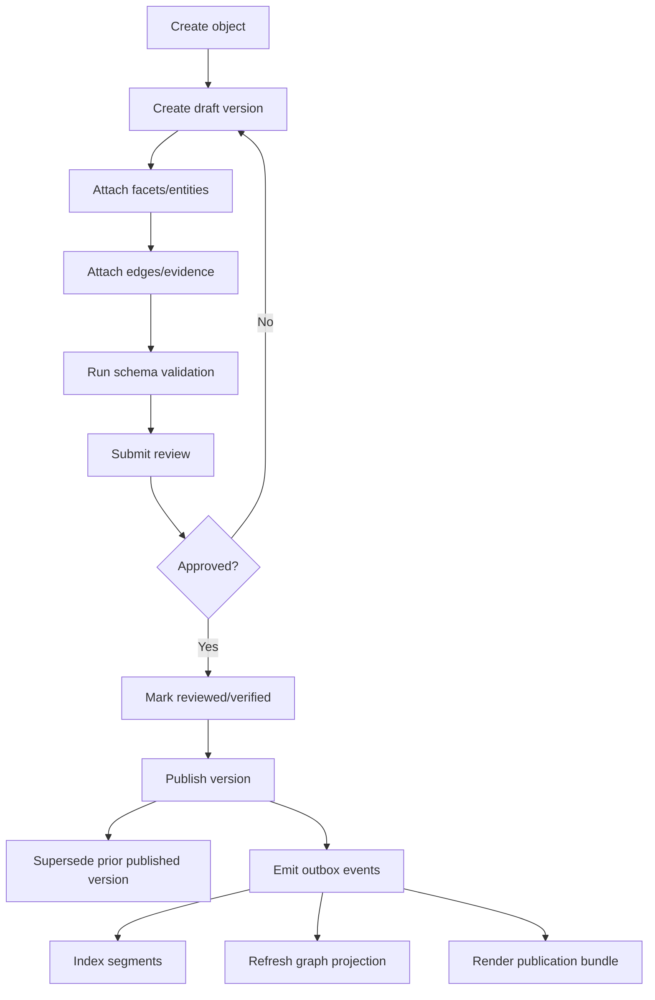
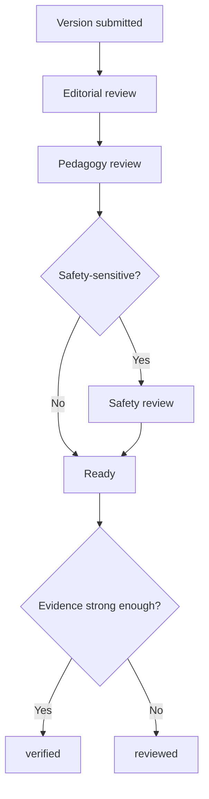
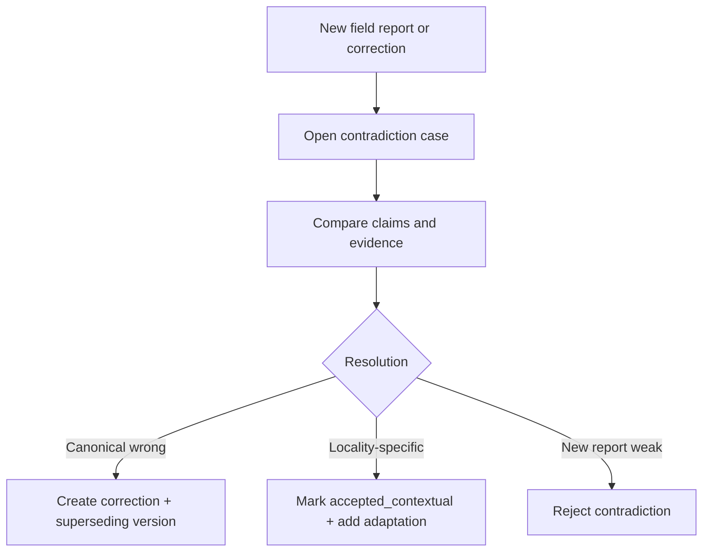
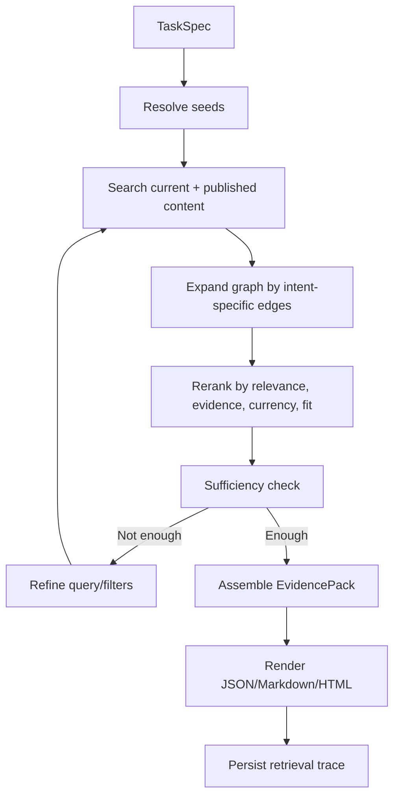

# Capability Commons — Agentic Data Lite Implementation Specification

**Version:** 1.0  
**Status:** Ready for implementation  
**Audience:** Backend, search, data, and infrastructure developers  
**Primary goal:** Adapt the useful parts of Agentic Data into a versioned, evidence-aware, pedagogically structured knowledge substrate for the open Capability Commons.

---

## Table of contents

1. Executive summary  
2. Architecture decisions  
3. System boundaries  
4. Domain model  
5. Enum vocabularies  
6. Postgres schema  
7. Type-specific object schemas  
8. Service boundaries and module ownership  
9. API surface  
10. Ingestion, review, publish, and retrieval flows  
11. Retrieval planner design  
12. Search and graph adapters  
13. Publication model  
14. Jobs and maintenance  
15. Migration guidance from existing Agentic Data  
16. Acceptance criteria  
17. Delivery plan

---

## 1) Executive summary

This system should **not** be implemented as “Neo4j-first RAG.” It should be implemented as a **modular monolith** with:

- **Postgres** as the canonical source of truth
- **versioned knowledge objects** as the main aggregate
- **typed edges** and **evidence spans** as first-class records
- **simple public-first permissions**
- **search and graph as adapters**, not as the canonical store
- **retrieval as an iterative planner** over current, versioned, context-filtered knowledge

The recommended v1 stack is:

- Postgres 16+
- `pgvector` for embeddings
- Postgres full-text search for lexical search
- object storage for attachments and raw source files
- FastAPI
- async SQLAlchemy / Alembic
- outbox events for index and graph projection synchronization

The recommended v2 additions are:

- OpenSearch adapter when corpus/search load justifies it
- Neo4j Community as a **read-optimized graph projection**
- more advanced contradiction detection and cross-community federation

### Core design choices

1. **Preserve the Agentic Data idea of Context Objects**, but repurpose them for the Commons.
2. **Expose them publicly as Knowledge Objects (KOs)** in the UI and docs.
3. **Keep the internal table name `context_object`** if reusing the Agentic Data codebase to minimize refactor cost.
4. **Every published object is versioned**.
5. **Every important claim can cite evidence spans**.
6. **Every instructional object carries pedagogical and deployment-context metadata**.
7. **Every retrieval result must prefer current, reviewed, context-fit evidence over mere semantic similarity**.
8. **Graph traversal is optional in v1** and should be implemented behind an interface so it can run on relational tables now and Neo4j later.

---

## 2) Architecture decisions

### 2.1 In-scope

This platform must support:

- versioned modules, guides, projects, worksheets, reference cards, glossaries, and teach-forward packets
- provenance and evidence citation
- contradiction detection and correction workflows
- contextual filtering by audience, housing, climate, budget, locale, and difficulty
- retrieval intents like `how_to`, `learn_path`, `localize`, `what_changed`, and `safety_check`
- publishing bundles that render public learning materials from canonical content
- field reports and local adaptations that can update or challenge guidance

### 2.2 Out-of-scope for v1

Do **not** build all of these in v1:

- complex enterprise ACLs
- connector sprawl
- Slack/Jira/GitHub as primary ingest sources
- mandatory Neo4j dependency
- mandatory OpenSearch dependency
- full-blown microservice deployment
- automated LLM extraction of every edge on day one

### 2.3 Deployment shape

Implement as a **modular monolith** first.

One FastAPI app, one Postgres database, one object store, plus adapter interfaces for search and graph. Use a clean internal package structure and outbox events so pieces can be extracted later if needed.

### 2.4 Storage responsibilities

| Store | Required in v1 | Responsibility |
|---|---:|---|
| Postgres | Yes | Canonical object/version store, facets, edges, evidence, reviews, contradictions, retrieval audit |
| Object storage | Yes | Raw files, attachments, diagrams, PDFs, source snapshots |
| pgvector (inside Postgres) | Yes | v1 embeddings |
| OpenSearch | No | Optional v2 search adapter |
| Neo4j Community | No | Optional v2 read model for graph-heavy queries |

---

## 3) System boundaries

The system has two conceptual layers.

### 3.1 Public learning layer

This is what learners and facilitators use.

It should expose:

- modules
- learning paths
- practical guides
- worksheets
- reference sheets
- teach-forward packets
- plain-language search
- “what should I learn next?” navigation

### 3.2 Evidence and maintenance layer

This is what editors, reviewers, maintainers, and AI retrieval use.

It owns:

- object versioning
- provenance
- evidence spans
- edge graph
- corrections
- contradictions
- review status
- retrieval traces
- publication bundles
- field reports and local adaptations

The public layer reads from the evidence layer. It should not own independent content truth.

---

## 4) Canonical domain model

### 4.1 Core aggregate: Context Object

A **Context Object** is the durable identity of a knowledge asset.

Examples:

- a skill guide
- a module
- a teach-forward packet
- a field report
- a correction
- a local adaptation

The object itself is stable. The content changes through **versions**.

### 4.2 Context Object Version

A **Context Object Version** is an immutable snapshot of content and metadata.

A version contains:

- title and summaries
- plain-language explanation
- markdown body
- structured type-specific data
- pedagogical metadata
- context filters
- validity and lifecycle status
- evidence confidence
- pointers to evidence, entities, and edges

### 4.3 Entity

Entities are stable things referred to by knowledge objects. They are not primarily instructional content themselves.

Examples:

- tool
- material
- topic
- hazard
- climate zone
- housing type
- learner profile
- place
- organization
- regulation
- standard

### 4.4 Edge

Edges are typed, version-aware relationships between either:

- object version → object version
- object version → entity
- entity → entity

In v1, edges should point to **specific versions** whenever the relationship depends on specific wording or evidence. The UI can resolve latest/current objects through a materialized view or service-layer resolution.

### 4.5 Evidence Source and Evidence Span

Every important claim can cite back to evidence.

- An **Evidence Source** is a book, URL, standard, field note, file, transcript, measurement record, image, or other source.
- An **Evidence Span** is the exact excerpt or region in that source that supports a claim or relationship.

Edges can be supported by one or more evidence spans.

### 4.6 Review Record

Reviews capture human evaluation.

Examples:

- editorial review
- expert review
- pedagogy review
- safety review
- translation review
- fact check

### 4.7 Contradiction Case

Contradictions are tracked explicitly rather than hidden.

Examples:

- two guides disagree on a factual claim
- a local adaptation conflicts with canonical guidance
- a safety note invalidates older advice
- two regions are both right but under different assumptions

### 4.8 Segment

Segments are search-sized content chunks derived from object versions.

They are the unit indexed for lexical and vector retrieval.

### 4.9 Retrieval Run

Each retrieval call is persisted with:

- task spec
- compiled plan
- per-iteration steps
- evidence candidates
- budgets spent
- final sufficiency score
- rendered evidence pack summary

---

## 5) Enum vocabularies

### 5.1 Context object type enum

```text
concept_note
skill_guide
project_blueprint
module
assessment
worksheet
reference_sheet
glossary
teach_forward_packet
learning_path
field_report
local_adaptation
expert_review
correction
safety_notice
translation
community_map
resource_directory
```

### 5.2 Lifecycle state enum

```text
draft
in_review
reviewed
verified
published
deprecated
archived
```

### 5.3 Validity status enum

```text
current
superseded
disputed
deprecated
retracted
```

### 5.4 Visibility enum

```text
public
contributor_only
editorial
restricted
```

### 5.5 Stage enum

```text
foundation
household
productive
community
advanced
```

### 5.6 Cost band enum

```text
free
low
medium
high
```

### 5.7 Risk band enum

```text
low
moderate
high
expert_only
```

### 5.8 Reading level enum

```text
general
intermediate
technical
```

### 5.9 Facet type enum

```text
domain
audience
housing_type
settlement_type
budget_profile
climate_zone
utility_profile
locale
language
delivery_mode
```

### 5.10 Entity type enum

```text
topic
tool
material
hazard
standard
regulation
organization
person
place
climate_zone
housing_type
learner_profile
community_asset
```

### 5.11 Edge type enum

V1 required set:

```text
contains
prerequisite_for
builds_on
assessed_by
next_step_for
alternative_to
supported_by
derived_from
quotes
summarizes
validated_by
contradicted_by
supersedes
deprecated_by
corrected_by
translated_from
forked_from
adapted_for
applies_in
requires_tool
requires_material
has_failure_mode
mitigated_by
unsafe_without
bounded_by
```

Notes:

- `contains` is used for ordered membership, for example `module -> skill_guide`.
- `prerequisite_for` and `next_step_for` drive learning path traversal.
- `supported_by`, `validated_by`, and `contradicted_by` drive evidence-aware retrieval.
- `supersedes`, `deprecated_by`, and `corrected_by` drive “what changed?” queries.
- `adapted_for`, `applies_in`, `requires_tool`, `requires_material`, and `bounded_by` drive context-fit answers.

### 5.12 Provenance method enum

```text
human_authored
deterministic_rule
llm_extracted
imported
human_verified
```

### 5.13 Review type enum

```text
editorial
expert
pedagogy
safety
translation
fact_check
```

### 5.14 Review outcome enum

```text
approved
changes_requested
rejected
verified
deprecated
disputed
```

### 5.15 Contradiction enums

Dimension:

```text
factual
safety
currency
regional
terminology
scope
```

Severity:

```text
low
medium
high
critical
```

Status:

```text
open
triaged
resolved
accepted_contextual
rejected
```

### 5.16 Retrieval intent enum

```text
how_to
learn_path
why
compare_options
localize
debug_failure
teach_forward
what_changed
safety_check
```

### 5.17 Retrieval step type enum

```text
resolve_seeds
search
graph_expand
rerank
sufficiency
assemble
```

---

## 6) Postgres schema

### 6.1 General notes

- Use UUID primary keys.
- Use `pgcrypto` for `gen_random_uuid()`.
- Use `pgvector` for embeddings.
- Use `pg_trgm` and `tsvector` for lexical search.
- Implement soft lifecycle transitions; never hard-delete published content.
- Implement graph relationships in Postgres first.
- Use an outbox table for downstream index / graph projections.

### 6.2 DDL

```sql
CREATE EXTENSION IF NOT EXISTS pgcrypto;
CREATE EXTENSION IF NOT EXISTS vector;
CREATE EXTENSION IF NOT EXISTS pg_trgm;

CREATE TYPE workspace_visibility AS ENUM ('public', 'private');

CREATE TYPE co_type AS ENUM (
  'concept_note',
  'skill_guide',
  'project_blueprint',
  'module',
  'assessment',
  'worksheet',
  'reference_sheet',
  'glossary',
  'teach_forward_packet',
  'learning_path',
  'field_report',
  'local_adaptation',
  'expert_review',
  'correction',
  'safety_notice',
  'translation',
  'community_map',
  'resource_directory'
);

CREATE TYPE lifecycle_state AS ENUM (
  'draft', 'in_review', 'reviewed', 'verified', 'published', 'deprecated', 'archived'
);

CREATE TYPE validity_status AS ENUM (
  'current', 'superseded', 'disputed', 'deprecated', 'retracted'
);

CREATE TYPE visibility_type AS ENUM (
  'public', 'contributor_only', 'editorial', 'restricted'
);

CREATE TYPE stage_type AS ENUM (
  'foundation', 'household', 'productive', 'community', 'advanced'
);

CREATE TYPE cost_band AS ENUM ('free', 'low', 'medium', 'high');

CREATE TYPE risk_band AS ENUM ('low', 'moderate', 'high', 'expert_only');

CREATE TYPE reading_level AS ENUM ('general', 'intermediate', 'technical');

CREATE TYPE facet_type AS ENUM (
  'domain',
  'audience',
  'housing_type',
  'settlement_type',
  'budget_profile',
  'climate_zone',
  'utility_profile',
  'locale',
  'language',
  'delivery_mode'
);

CREATE TYPE entity_type AS ENUM (
  'topic',
  'tool',
  'material',
  'hazard',
  'standard',
  'regulation',
  'organization',
  'person',
  'place',
  'climate_zone',
  'housing_type',
  'learner_profile',
  'community_asset'
);

CREATE TYPE entity_status AS ENUM ('active', 'deprecated', 'merged');

CREATE TYPE node_kind AS ENUM ('object_version', 'entity');

CREATE TYPE edge_type AS ENUM (
  'contains',
  'prerequisite_for',
  'builds_on',
  'assessed_by',
  'next_step_for',
  'alternative_to',
  'supported_by',
  'derived_from',
  'quotes',
  'summarizes',
  'validated_by',
  'contradicted_by',
  'supersedes',
  'deprecated_by',
  'corrected_by',
  'translated_from',
  'forked_from',
  'adapted_for',
  'applies_in',
  'requires_tool',
  'requires_material',
  'has_failure_mode',
  'mitigated_by',
  'unsafe_without',
  'bounded_by'
);

CREATE TYPE provenance_method AS ENUM (
  'human_authored',
  'deterministic_rule',
  'llm_extracted',
  'imported',
  'human_verified'
);

CREATE TYPE relation_status AS ENUM ('current', 'superseded', 'disputed', 'deprecated');

CREATE TYPE evidence_source_kind AS ENUM (
  'url',
  'file',
  'book',
  'standard',
  'field_observation',
  'transcript',
  'photo',
  'measurement',
  'external_doc'
);

CREATE TYPE trust_tier AS ENUM ('primary', 'secondary', 'field_note', 'anecdotal');

CREATE TYPE review_type AS ENUM (
  'editorial',
  'expert',
  'pedagogy',
  'safety',
  'translation',
  'fact_check'
);

CREATE TYPE review_outcome AS ENUM (
  'approved',
  'changes_requested',
  'rejected',
  'verified',
  'deprecated',
  'disputed'
);

CREATE TYPE contradiction_dimension AS ENUM (
  'factual',
  'safety',
  'currency',
  'regional',
  'terminology',
  'scope'
);

CREATE TYPE severity_level AS ENUM ('low', 'medium', 'high', 'critical');

CREATE TYPE contradiction_status AS ENUM (
  'open',
  'triaged',
  'resolved',
  'accepted_contextual',
  'rejected'
);

CREATE TYPE retrieval_intent AS ENUM (
  'how_to',
  'learn_path',
  'why',
  'compare_options',
  'localize',
  'debug_failure',
  'teach_forward',
  'what_changed',
  'safety_check'
);

CREATE TYPE retrieval_run_status AS ENUM (
  'running',
  'completed',
  'failed',
  'budget_exhausted'
);

CREATE TYPE retrieval_step_type AS ENUM (
  'resolve_seeds',
  'search',
  'graph_expand',
  'rerank',
  'sufficiency',
  'assemble'
);

CREATE TABLE workspaces (
  id UUID PRIMARY KEY DEFAULT gen_random_uuid(),
  slug TEXT NOT NULL UNIQUE,
  name TEXT NOT NULL,
  visibility workspace_visibility NOT NULL DEFAULT 'public',
  default_language TEXT NOT NULL DEFAULT 'en',
  created_at TIMESTAMPTZ NOT NULL DEFAULT now()
);

CREATE TABLE context_objects (
  id UUID PRIMARY KEY DEFAULT gen_random_uuid(),
  workspace_id UUID NOT NULL REFERENCES workspaces(id) ON DELETE CASCADE,
  slug TEXT NOT NULL,
  type co_type NOT NULL,
  canonical_title TEXT NOT NULL,
  current_version_id UUID NULL,
  lifecycle_state lifecycle_state NOT NULL DEFAULT 'draft',
  visibility visibility_type NOT NULL DEFAULT 'public',
  default_language TEXT NOT NULL DEFAULT 'en',
  created_by UUID NULL,
  created_at TIMESTAMPTZ NOT NULL DEFAULT now(),
  updated_at TIMESTAMPTZ NOT NULL DEFAULT now(),
  published_at TIMESTAMPTZ NULL,
  archived_at TIMESTAMPTZ NULL,
  UNIQUE (workspace_id, slug)
);

CREATE TABLE context_object_versions (
  id UUID PRIMARY KEY DEFAULT gen_random_uuid(),
  context_object_id UUID NOT NULL REFERENCES context_objects(id) ON DELETE CASCADE,
  version_no INTEGER NOT NULL,
  title TEXT NOT NULL,
  summary_short TEXT NULL,
  summary_medium TEXT NULL,
  summary_long TEXT NULL,
  plain_language TEXT NOT NULL,
  markdown_body TEXT NOT NULL,
  structured_data JSONB NOT NULL DEFAULT '{}'::jsonb,
  validity_status validity_status NOT NULL DEFAULT 'current',
  valid_from TIMESTAMPTZ NULL,
  valid_to TIMESTAMPTZ NULL,
  stage stage_type NULL,
  difficulty SMALLINT NULL CHECK (difficulty BETWEEN 1 AND 5),
  estimated_minutes INTEGER NULL CHECK (estimated_minutes > 0),
  cost_band cost_band NOT NULL DEFAULT 'free',
  risk_band risk_band NOT NULL DEFAULT 'low',
  reading_level reading_level NOT NULL DEFAULT 'general',
  beginner_safe BOOLEAN NOT NULL DEFAULT TRUE,
  teach_forward_ready BOOLEAN NOT NULL DEFAULT FALSE,
  requires_professional BOOLEAN NOT NULL DEFAULT FALSE,
  source_confidence NUMERIC(3,2) NULL CHECK (source_confidence >= 0 AND source_confidence <= 1),
  evidence_confidence NUMERIC(3,2) NULL CHECK (evidence_confidence >= 0 AND evidence_confidence <= 1),
  locale_scope TEXT NOT NULL DEFAULT 'global',
  language_code TEXT NOT NULL DEFAULT 'en',
  supersedes_version_id UUID NULL REFERENCES context_object_versions(id),
  checksum TEXT NULL,
  created_by UUID NULL,
  created_at TIMESTAMPTZ NOT NULL DEFAULT now(),
  UNIQUE (context_object_id, version_no),
  search_tsv TSVECTOR GENERATED ALWAYS AS (
    to_tsvector(
      'english',
      coalesce(title, '') || ' ' ||
      coalesce(summary_short, '') || ' ' ||
      coalesce(summary_medium, '') || ' ' ||
      coalesce(plain_language, '') || ' ' ||
      coalesce(markdown_body, '')
    )
  ) STORED
);

ALTER TABLE context_objects
  ADD CONSTRAINT fk_context_objects_current_version
  FOREIGN KEY (current_version_id)
  REFERENCES context_object_versions(id);

CREATE TABLE context_object_facets (
  context_object_version_id UUID NOT NULL REFERENCES context_object_versions(id) ON DELETE CASCADE,
  facet_type facet_type NOT NULL,
  facet_value TEXT NOT NULL,
  PRIMARY KEY (context_object_version_id, facet_type, facet_value)
);

CREATE TABLE entities (
  id UUID PRIMARY KEY DEFAULT gen_random_uuid(),
  workspace_id UUID NOT NULL REFERENCES workspaces(id) ON DELETE CASCADE,
  entity_type entity_type NOT NULL,
  canonical_name TEXT NOT NULL,
  status entity_status NOT NULL DEFAULT 'active',
  metadata JSONB NOT NULL DEFAULT '{}'::jsonb,
  created_at TIMESTAMPTZ NOT NULL DEFAULT now(),
  UNIQUE (workspace_id, entity_type, canonical_name)
);

CREATE TABLE entity_aliases (
  id UUID PRIMARY KEY DEFAULT gen_random_uuid(),
  entity_id UUID NOT NULL REFERENCES entities(id) ON DELETE CASCADE,
  alias TEXT NOT NULL,
  UNIQUE (entity_id, alias)
);

CREATE TABLE context_object_entities (
  context_object_version_id UUID NOT NULL REFERENCES context_object_versions(id) ON DELETE CASCADE,
  entity_id UUID NOT NULL REFERENCES entities(id) ON DELETE CASCADE,
  mention_count INTEGER NOT NULL DEFAULT 1,
  role_label TEXT NULL,
  is_primary BOOLEAN NOT NULL DEFAULT FALSE,
  PRIMARY KEY (context_object_version_id, entity_id)
);

CREATE TABLE edges (
  id UUID PRIMARY KEY DEFAULT gen_random_uuid(),
  workspace_id UUID NOT NULL REFERENCES workspaces(id) ON DELETE CASCADE,
  src_node_kind node_kind NOT NULL,
  src_id UUID NOT NULL,
  edge_type edge_type NOT NULL,
  dst_node_kind node_kind NOT NULL,
  dst_id UUID NOT NULL,
  ordinal INTEGER NULL,
  confidence NUMERIC(3,2) NOT NULL DEFAULT 1.0 CHECK (confidence >= 0 AND confidence <= 1),
  provenance_method provenance_method NOT NULL DEFAULT 'human_authored',
  status relation_status NOT NULL DEFAULT 'current',
  valid_from TIMESTAMPTZ NULL,
  valid_to TIMESTAMPTZ NULL,
  metadata JSONB NOT NULL DEFAULT '{}'::jsonb,
  created_by UUID NULL,
  created_at TIMESTAMPTZ NOT NULL DEFAULT now()
);

CREATE TABLE evidence_sources (
  id UUID PRIMARY KEY DEFAULT gen_random_uuid(),
  workspace_id UUID NOT NULL REFERENCES workspaces(id) ON DELETE CASCADE,
  source_kind evidence_source_kind NOT NULL,
  title TEXT NOT NULL,
  uri TEXT NULL,
  citation_text TEXT NULL,
  trust_tier trust_tier NOT NULL DEFAULT 'secondary',
  license TEXT NULL,
  language_code TEXT NOT NULL DEFAULT 'en',
  metadata JSONB NOT NULL DEFAULT '{}'::jsonb,
  created_by UUID NULL,
  created_at TIMESTAMPTZ NOT NULL DEFAULT now()
);

CREATE TABLE evidence_spans (
  id UUID PRIMARY KEY DEFAULT gen_random_uuid(),
  source_id UUID NOT NULL REFERENCES evidence_sources(id) ON DELETE CASCADE,
  context_object_version_id UUID NULL REFERENCES context_object_versions(id) ON DELETE SET NULL,
  segment_id UUID NULL,
  start_char INTEGER NOT NULL CHECK (start_char >= 0),
  end_char INTEGER NOT NULL CHECK (end_char >= start_char),
  excerpt TEXT NOT NULL,
  checksum TEXT NULL,
  created_at TIMESTAMPTZ NOT NULL DEFAULT now()
);

CREATE TABLE edge_evidence_spans (
  edge_id UUID NOT NULL REFERENCES edges(id) ON DELETE CASCADE,
  evidence_span_id UUID NOT NULL REFERENCES evidence_spans(id) ON DELETE CASCADE,
  PRIMARY KEY (edge_id, evidence_span_id)
);

CREATE TABLE review_records (
  id UUID PRIMARY KEY DEFAULT gen_random_uuid(),
  workspace_id UUID NOT NULL REFERENCES workspaces(id) ON DELETE CASCADE,
  context_object_version_id UUID NOT NULL REFERENCES context_object_versions(id) ON DELETE CASCADE,
  review_type review_type NOT NULL,
  outcome review_outcome NOT NULL,
  reviewer_id UUID NULL,
  commentary TEXT NULL,
  checklist JSONB NOT NULL DEFAULT '{}'::jsonb,
  created_at TIMESTAMPTZ NOT NULL DEFAULT now()
);

CREATE TABLE contradiction_cases (
  id UUID PRIMARY KEY DEFAULT gen_random_uuid(),
  workspace_id UUID NOT NULL REFERENCES workspaces(id) ON DELETE CASCADE,
  left_version_id UUID NOT NULL REFERENCES context_object_versions(id) ON DELETE CASCADE,
  right_version_id UUID NOT NULL REFERENCES context_object_versions(id) ON DELETE CASCADE,
  dimension contradiction_dimension NOT NULL,
  severity severity_level NOT NULL DEFAULT 'medium',
  status contradiction_status NOT NULL DEFAULT 'open',
  opened_by UUID NULL,
  opened_at TIMESTAMPTZ NOT NULL DEFAULT now(),
  resolved_by UUID NULL,
  resolved_at TIMESTAMPTZ NULL,
  resolution_note TEXT NULL,
  resolution_version_id UUID NULL REFERENCES context_object_versions(id) ON DELETE SET NULL
);

CREATE TABLE content_segments (
  id UUID PRIMARY KEY DEFAULT gen_random_uuid(),
  workspace_id UUID NOT NULL REFERENCES workspaces(id) ON DELETE CASCADE,
  context_object_version_id UUID NOT NULL REFERENCES context_object_versions(id) ON DELETE CASCADE,
  ordinal INTEGER NOT NULL,
  text_content TEXT NOT NULL,
  token_count INTEGER NULL CHECK (token_count IS NULL OR token_count >= 0),
  embedding VECTOR(1536) NULL,
  metadata JSONB NOT NULL DEFAULT '{}'::jsonb,
  created_at TIMESTAMPTZ NOT NULL DEFAULT now(),
  UNIQUE (context_object_version_id, ordinal)
);

ALTER TABLE evidence_spans
  ADD CONSTRAINT fk_evidence_spans_segment
  FOREIGN KEY (segment_id)
  REFERENCES content_segments(id)
  ON DELETE SET NULL;

CREATE TABLE retrieval_runs (
  id UUID PRIMARY KEY DEFAULT gen_random_uuid(),
  workspace_id UUID NOT NULL REFERENCES workspaces(id) ON DELETE CASCADE,
  requester_id UUID NULL,
  intent retrieval_intent NOT NULL,
  query_text TEXT NOT NULL,
  task_spec JSONB NOT NULL,
  compiled_plan JSONB NOT NULL DEFAULT '{}'::jsonb,
  status retrieval_run_status NOT NULL DEFAULT 'running',
  sufficiency_score NUMERIC(4,3) NOT NULL DEFAULT 0,
  budget_snapshot JSONB NOT NULL DEFAULT '{}'::jsonb,
  result_summary JSONB NOT NULL DEFAULT '{}'::jsonb,
  created_at TIMESTAMPTZ NOT NULL DEFAULT now(),
  completed_at TIMESTAMPTZ NULL
);

CREATE TABLE retrieval_steps (
  id UUID PRIMARY KEY DEFAULT gen_random_uuid(),
  retrieval_run_id UUID NOT NULL REFERENCES retrieval_runs(id) ON DELETE CASCADE,
  iteration_no INTEGER NOT NULL,
  step_type retrieval_step_type NOT NULL,
  query_text TEXT NULL,
  inputs JSONB NOT NULL DEFAULT '{}'::jsonb,
  outputs JSONB NOT NULL DEFAULT '{}'::jsonb,
  latency_ms INTEGER NULL CHECK (latency_ms IS NULL OR latency_ms >= 0),
  budget_spent JSONB NOT NULL DEFAULT '{}'::jsonb,
  created_at TIMESTAMPTZ NOT NULL DEFAULT now()
);

CREATE TABLE object_files (
  id UUID PRIMARY KEY DEFAULT gen_random_uuid(),
  context_object_version_id UUID NOT NULL REFERENCES context_object_versions(id) ON DELETE CASCADE,
  object_store_key TEXT NOT NULL,
  media_type TEXT NOT NULL,
  byte_size BIGINT NULL CHECK (byte_size IS NULL OR byte_size >= 0),
  checksum TEXT NULL,
  label TEXT NULL,
  created_at TIMESTAMPTZ NOT NULL DEFAULT now()
);

CREATE TABLE outbox_events (
  id BIGSERIAL PRIMARY KEY,
  aggregate_type TEXT NOT NULL,
  aggregate_id UUID NOT NULL,
  event_type TEXT NOT NULL,
  payload JSONB NOT NULL,
  created_at TIMESTAMPTZ NOT NULL DEFAULT now(),
  processed_at TIMESTAMPTZ NULL
);

CREATE INDEX idx_cov_context_object_id ON context_object_versions(context_object_id, version_no DESC);
CREATE INDEX idx_cov_validity ON context_object_versions(validity_status, created_at DESC);
CREATE INDEX idx_cov_search_tsv ON context_object_versions USING GIN(search_tsv);

CREATE INDEX idx_cof_facet_lookup ON context_object_facets(facet_type, facet_value, context_object_version_id);

CREATE INDEX idx_entities_lookup ON entities(workspace_id, entity_type, canonical_name);
CREATE INDEX idx_entity_alias_lookup ON entity_aliases(alias);

CREATE INDEX idx_edges_src ON edges(workspace_id, src_node_kind, src_id, edge_type);
CREATE INDEX idx_edges_dst ON edges(workspace_id, dst_node_kind, dst_id, edge_type);
CREATE INDEX idx_edges_status ON edges(status, created_at DESC);

CREATE INDEX idx_review_records_version ON review_records(context_object_version_id, created_at DESC);

CREATE INDEX idx_contradiction_cases_versions ON contradiction_cases(left_version_id, right_version_id);

CREATE INDEX idx_content_segments_version ON content_segments(context_object_version_id, ordinal);
CREATE INDEX idx_content_segments_embedding
  ON content_segments
  USING ivfflat (embedding vector_cosine_ops)
  WITH (lists = 100);

CREATE INDEX idx_retrieval_runs_workspace_created_at ON retrieval_runs(workspace_id, created_at DESC);
CREATE INDEX idx_retrieval_steps_run_iteration ON retrieval_steps(retrieval_run_id, iteration_no, created_at);
CREATE INDEX idx_outbox_unprocessed ON outbox_events(processed_at) WHERE processed_at IS NULL;
```

### 6.3 Required service-layer constraints

Because `edges` is polymorphic, enforce these invariants in the service layer:

1. `src_id` must exist in the table implied by `src_node_kind`.
2. `dst_id` must exist in the table implied by `dst_node_kind`.
3. `contains` must have `src_node_kind = object_version`.
4. `requires_tool`, `requires_material`, `applies_in`, and `adapted_for` normally target entities.
5. `supersedes`, `deprecated_by`, and `corrected_by` must link object_version → object_version.
6. `assessed_by` must link object_version → object_version where target object type is `assessment`.
7. `translated_from` must connect objects of equivalent semantic type.
8. only one `current` published version per `context_object` may be designated as `current_version_id`.

---

## 7) Type-specific object schemas

All type-specific details live in `context_object_versions.structured_data`.

The platform must validate `structured_data` against a type-specific schema before allowing a version to move to `reviewed` or beyond.

### 7.1 `skill_guide`

Required keys:

```json
{
  "performance_statement": "string",
  "learning_objectives": ["string"],
  "tools": ["string"],
  "materials": ["string"],
  "steps_summary": ["string"],
  "success_criteria": ["string"],
  "failure_modes": ["string"],
  "safety_boundary": "string",
  "stop_conditions": ["string"],
  "teach_forward": {
    "three_minute_script": "string",
    "ten_minute_outline": ["string"],
    "handout_points": ["string"]
  }
}
```

### 7.2 `project_blueprint`

Required keys:

```json
{
  "goal": "string",
  "deliverables": ["string"],
  "acceptance_criteria": ["string"],
  "time_box_hours": 0,
  "team_size": 1,
  "budget_notes": "string",
  "variants": ["string"]
}
```

### 7.3 `module`

Required keys:

```json
{
  "week": 1,
  "learning_objectives": ["string"],
  "seminar_outline": ["string"],
  "lab": "string",
  "field_task": "string",
  "teach_forward_task": "string",
  "completion_requirements": ["string"]
}
```

Ordered membership is represented by `contains` edges from module version to its component versions.

### 7.4 `assessment`

Required keys:

```json
{
  "assessment_type": "quiz|checklist|demo|portfolio_review",
  "rubric": ["string"],
  "passing_threshold": "string",
  "evidence_required": ["string"]
}
```

### 7.5 `teach_forward_packet`

Required keys:

```json
{
  "audience": "string",
  "duration_minutes": 10,
  "facilitator_outline": ["string"],
  "visual_aids": ["string"],
  "handout_points": ["string"],
  "discussion_prompts": ["string"]
}
```

### 7.6 `field_report`

Required keys:

```json
{
  "setting": "string",
  "inputs": ["string"],
  "observations": ["string"],
  "outcome": "string",
  "failures": ["string"],
  "adaptations": ["string"],
  "confidence_note": "string"
}
```

### 7.7 `local_adaptation`

Required keys:

```json
{
  "adapted_for": ["string"],
  "assumptions": ["string"],
  "changes_from_canonical": ["string"],
  "applicability_limits": ["string"],
  "evidence_note": "string"
}
```

### 7.8 `correction`

Required keys:

```json
{
  "corrects_claim": "string",
  "reason": "string",
  "replacement_guidance": "string",
  "severity": "low|medium|high|critical",
  "effective_from": "timestamp"
}
```

### 7.9 `reference_sheet`

Required keys:

```json
{
  "key_points": ["string"],
  "checklists": ["string"],
  "formulas_or_rules": ["string"],
  "glossary_terms": ["string"]
}
```

### 7.10 `learning_path`

Required keys:

```json
{
  "path_goal": "string",
  "target_profiles": ["string"],
  "completion_artifacts": ["string"]
}
```

Ordered membership is represented by `contains` edges from learning path version to module/object versions.

---

## 8) Service boundaries and module ownership

### 8.1 Implementation shape

Implement these as internal modules/packages first, not separately deployed services.

Recommended package layout:

```text
src/capability_commons/
  api/
  config.py
  db/
  models/
  registry/
  entities/
  evidence/
  review/
  search/
    adapters/
      postgres_search.py
      opensearch_search.py
  graph/
    adapters/
      relational_graph.py
      neo4j_graph.py
  retrieval/
  publication/
  jobs/
  storage/
  audit/
```

### 8.2 Module ownership table

| Module | Owns writes to | Reads from | Responsibilities |
|---|---|---|---|
| `registry` | context_objects, context_object_versions, context_object_facets, context_object_entities, edges, object_files, outbox_events | entities, evidence, review | create/update versions, attach facets/entities, create edges, publish/supersede, enforce lifecycle rules |
| `entities` | entities, entity_aliases, outbox_events | registry | create, merge, alias, resolve entities |
| `evidence` | evidence_sources, evidence_spans, edge_evidence_spans, outbox_events | registry, segments | create sources, create spans, attach citations |
| `review` | review_records, contradiction_cases, outbox_events | registry, evidence | review workflows, contradiction handling, verification, deprecation recommendations |
| `search` | content_segments | registry | chunk, embed, lexical indexing, hybrid search |
| `graph` | no canonical writes in v1 | registry, edges | recursive traversal via relational queries or projection adapter |
| `retrieval` | retrieval_runs, retrieval_steps | registry, search, graph, review | plan, search, expand, rerank, score sufficiency, assemble evidence pack |
| `publication` | outbox_events only | registry, retrieval | render public bundles, static exports, reading views |
| `jobs` | depends on module | all | expiry, reconsolidation, reindex, graph projection sync |
| `audit` | retrieval_runs, retrieval_steps | all | traceability and ops visibility |

### 8.3 No-crossing rules

1. `retrieval` may never mutate canonical content.
2. `search` may never be source of truth.
3. `graph` may never be source of truth.
4. `publication` may only read published/current content unless explicitly in preview mode.
5. `review` can recommend lifecycle changes, but only `registry` performs state transitions.
6. all downstream projections must be driven by outbox events or explicit rebuild jobs.

### 8.4 Internal service interfaces

#### RegistryService

```python
create_object(...)
create_version(...)
update_draft_version(...)
attach_facets(...)
attach_entities(...)
create_edge(...)
publish_version(...)
deprecate_object(...)
supersede_with_version(...)
get_object(...)
get_version(...)
list_current(...)
```

#### EntityService

```python
create_entity(...)
add_alias(...)
resolve_entities(...)
merge_entities(...)
```

#### EvidenceService

```python
create_source(...)
create_span(...)
attach_span_to_edge(...)
list_citations_for_version(...)
```

#### ReviewService

```python
submit_review(...)
open_contradiction(...)
resolve_contradiction(...)
mark_verified(...)
mark_disputed(...)
propose_deprecation(...)
```

#### SearchAdapter

```python
index_version(version_id)
delete_version(version_id)
search(query, filters, top_k)
fetch_segments(segment_ids)
```

#### GraphAdapter

```python
neighbors(seed_nodes, edge_types, depth, filters)
paths_between(src, dst, edge_types, max_depth)
ordered_members(group_version_id)
reverse_prerequisites(version_ids)
```

#### RetrievalService

```python
compile_plan(task_spec)
execute_plan(plan)
assemble_evidence_pack(run_id)
render_evidence_pack(run_id, format="json|markdown|html")
```

#### PublicationService

```python
render_public_object(version_id)
render_module_bundle(version_id)
render_learning_path(version_id)
export_static_bundle(version_id)
```

---

## 9) API surface

All endpoints below are intended for v1.

### 9.1 Object registry

```text
POST   /v1/objects
POST   /v1/objects/{object_id}/versions
PATCH  /v1/objects/{object_id}/versions/{version_id}
POST   /v1/objects/{object_id}/versions/{version_id}/publish
POST   /v1/objects/{object_id}/versions/{version_id}/facets
POST   /v1/objects/{object_id}/versions/{version_id}/entities
GET    /v1/objects/{object_id}
GET    /v1/objects/{object_id}/versions
GET    /v1/objects/{object_id}/current
```

### 9.2 Edges and evidence

```text
POST   /v1/edges
GET    /v1/edges?src_id=&edge_type=&dst_id=
POST   /v1/evidence/sources
POST   /v1/evidence/spans
POST   /v1/evidence/edge_citations
GET    /v1/objects/{object_id}/versions/{version_id}/citations
```

### 9.3 Review and truth maintenance

```text
POST   /v1/reviews
POST   /v1/contradictions
POST   /v1/contradictions/{id}/resolve
POST   /v1/objects/{object_id}/versions/{version_id}/verify
POST   /v1/objects/{object_id}/versions/{version_id}/dispute
POST   /v1/objects/{object_id}/versions/{version_id}/deprecate
```

### 9.4 Search and retrieval

```text
POST   /v1/search
POST   /v1/retrieve/evidence_pack
GET    /v1/retrieval_runs/{run_id}
GET    /v1/retrieval_runs/{run_id}/steps
```

### 9.5 Publication

```text
GET    /v1/public/objects/{slug}
GET    /v1/public/modules/{slug}
GET    /v1/public/paths/{slug}
GET    /v1/public/objects/{slug}/bundle
```

### 9.6 Example payloads

#### Create object

```json
{
  "workspace_id": "uuid",
  "slug": "power-runtime-calculation",
  "type": "skill_guide",
  "canonical_title": "Estimate Backup Runtime",
  "visibility": "public"
}
```

#### Create version

```json
{
  "title": "Estimate Backup Runtime",
  "summary_short": "Calculate how long critical loads can run on stored power.",
  "plain_language": "This guide helps you estimate how long your essential devices can run during an outage.",
  "markdown_body": "# Estimate Backup Runtime\n...",
  "stage": "household",
  "difficulty": 2,
  "estimated_minutes": 45,
  "cost_band": "free",
  "risk_band": "moderate",
  "reading_level": "general",
  "beginner_safe": true,
  "teach_forward_ready": true,
  "structured_data": {
    "performance_statement": "Calculate runtime for one backup scenario.",
    "learning_objectives": [
      "Identify device wattage",
      "Compute runtime from stored energy",
      "Explain the result to another person"
    ],
    "tools": ["calculator"],
    "materials": ["device labels or load list"],
    "steps_summary": [
      "List critical devices",
      "Find wattage",
      "Compute watt-hours needed",
      "Compare against available stored energy"
    ],
    "success_criteria": [
      "Runtime table completed",
      "Assumptions clearly stated"
    ],
    "failure_modes": [
      "Ignoring surge load",
      "Using rated battery capacity instead of usable capacity"
    ],
    "safety_boundary": "Do not perform electrical panel work for this guide.",
    "stop_conditions": [
      "Unknown wiring conditions",
      "Need to modify fixed household wiring"
    ],
    "teach_forward": {
      "three_minute_script": "A short explainer...",
      "ten_minute_outline": ["Context", "Formula", "Example"],
      "handout_points": ["Watts", "Watt-hours", "Usable battery"]
    }
  }
}
```

#### Retrieval request

```json
{
  "workspace_id": "uuid",
  "requester_id": "uuid",
  "query": "I rent in a cold climate and want the safest low-cost path to prepare for 72-hour winter outages.",
  "intent": "learn_path",
  "facet_filters": {
    "housing_type": ["renter", "apartment"],
    "climate_zone": ["cold"],
    "budget_profile": ["low"],
    "audience": ["beginner"]
  },
  "seed_object_ids": [],
  "seed_entity_ids": [],
  "budgets": {
    "max_latency_ms": 5000,
    "max_iterations": 4,
    "max_search_results": 80,
    "max_graph_depth": 3,
    "max_segments": 40,
    "max_model_calls": 2
  },
  "required_evidence": {
    "must_cite_sources": true,
    "min_reviewed_objects": 3,
    "prefer_verified": true
  },
  "output_mode": "public_answer"
}
```

---

## 10) Ingestion, review, publish, and retrieval flows

### 10.1 Create/edit/publish flow



### 10.2 Review flow



### 10.3 Contradiction flow



### 10.4 Retrieval flow



---

## 11) Retrieval planner design

### 11.1 TaskSpec

Minimal required fields:

```json
{
  "workspace_id": "uuid",
  "requester_id": "uuid|null",
  "query": "string",
  "intent": "how_to|learn_path|why|compare_options|localize|debug_failure|teach_forward|what_changed|safety_check",
  "facet_filters": {},
  "seed_object_ids": [],
  "seed_entity_ids": [],
  "budgets": {},
  "required_evidence": {},
  "output_mode": "public_answer|editorial_pack|developer_trace"
}
```

### 11.2 Intent strategies

| Intent | Initial filter bias | Allowed edge types | Required slots |
|---|---|---|---|
| `how_to` | published + current + beginner-safe if requested | contains, prerequisite_for, requires_tool, requires_material, has_failure_mode, mitigated_by, bounded_by, supported_by | guide, reference, at least 1 failure mode, at least 1 safety boundary |
| `learn_path` | published + current + context-fit | prerequisite_for, next_step_for, contains, assessed_by, alternative_to | ordered path of 3-7 nodes, 1 assessment, 1 teach-forward artifact |
| `why` | reviewed/verified preferred | supported_by, derived_from, quotes, validates_by, corrected_by, contradicted_by | answer rationale, at least 2 supporting citations, contradiction summary if any |
| `compare_options` | context-fit strongly weighted | alternative_to, adapted_for, applies_in, bounded_by, mitigated_by | 2+ options with context tradeoffs |
| `localize` | facet overlap strongest | adapted_for, applies_in, bounded_by, supported_by | localized recommendation, applicability limits |
| `debug_failure` | field reports and failure cases boosted | has_failure_mode, mitigated_by, corrected_by, contradicted_by, supported_by | probable causes, corrective actions, safety boundaries |
| `teach_forward` | teach_forward_ready required | contains, summarizes, next_step_for | 3-minute version, 10-minute version, handout points |
| `what_changed` | latest + supersession chains | supersedes, corrected_by, deprecated_by, contradicted_by | current version, replaced version(s), delta summary |
| `safety_check` | safety_notice and reviewed guides boosted | unsafe_without, bounded_by, mitigated_by, corrected_by, contradicted_by | hazards, stop conditions, mitigations, confidence |

Note: `validates_by` above should read `validated_by`; keep the actual enum `validated_by` in code.

### 11.3 Scoring model

Start with a simple weighted score.

```text
final_score =
  0.30 * textual_relevance
+ 0.20 * evidence_quality
+ 0.15 * context_fit
+ 0.15 * review_status
+ 0.10 * currency
+ 0.10 * graph_proximity
- contradiction_penalty
```

Suggested components:

- `textual_relevance`: lexical + vector blend
- `evidence_quality`: citation count + trust tier + evidence confidence
- `context_fit`: facet overlap, locale scope match
- `review_status`: verified > reviewed > draft
- `currency`: current/published > superseded/deprecated
- `graph_proximity`: fewer hops from seed nodes preferred
- `contradiction_penalty`: subtract if unresolved contradictions are attached

### 11.4 Sufficiency scoring

Use slot coverage rather than only aggregate score.

```text
sufficiency =
  0.45 * slot_coverage
+ 0.20 * average_evidence_quality
+ 0.15 * context_fit_of_top_results
+ 0.10 * currency_of_top_results
+ 0.10 * review_status_of_top_results
```

Stop when:

1. `sufficiency >= threshold`
2. all mandatory slots are filled
3. minimum primary/reviewed evidence count satisfied
4. diminishing returns across last iteration < epsilon

### 11.5 EvidencePack output

```json
{
  "run_id": "uuid",
  "intent": "learn_path",
  "answer_summary": "string",
  "recommended_objects": [
    {
      "object_id": "uuid",
      "version_id": "uuid",
      "slug": "string",
      "title": "string",
      "type": "module",
      "score": 0.91,
      "why_included": ["facet match", "prerequisite", "verified"]
    }
  ],
  "citations": [
    {
      "source_id": "uuid",
      "title": "string",
      "excerpt": "string"
    }
  ],
  "contradictions": [],
  "gaps": [],
  "trace_ref": "uuid"
}
```

---

## 12) Search and graph adapters

### 12.1 Search adapter contract

A search adapter must support:

- indexing object version segments
- lexical search
- vector search
- blended ranking
- facet filtering
- status filtering
- version resolution

#### V1 implementation: PostgresSearchAdapter

Use:

- `content_segments.embedding` with `pgvector`
- `context_object_versions.search_tsv` with Postgres FTS
- facet joins via `context_object_facets`
- current/published filters via joins to `context_objects` and version status

Suggested search steps:

1. lexical candidate query on `search_tsv`
2. vector candidate query on `content_segments.embedding`
3. reciprocal rank fusion in application code
4. join back to object versions
5. apply context-fit boosts

### 12.2 Graph adapter contract

A graph adapter must support:

- neighbor expansion by edge type and depth
- ordered membership lookup
- path tracing
- reverse prerequisite lookup
- supersession chain lookup

#### V1 implementation: RelationalGraphAdapter

Use recursive CTEs over `edges`.

Required queries:

- `neighbors(seed_ids, edge_types, depth)`
- `ordered_members(group_version_id)`
- `supersession_chain(version_id)`
- `prerequisite_chain(version_id)`
- `reverse_dependents(version_id)`

#### V2 implementation: Neo4jGraphAdapter

Use outbox-driven projection. Neo4j should be read-only relative to canonical content.

Projection node types:

- `ObjectVersion`
- `Entity`

Projection edge properties:

- `edge_type`
- `confidence`
- `status`
- `valid_from`
- `valid_to`
- `ordinal`

Projection rebuild strategies:

- full rebuild job
- incremental projection from outbox events

---

## 13) Publication model

### 13.1 Public artifacts

Every published `module` or `skill_guide` should be able to render into a six-part bundle:

1. hook
2. primer
3. lab guide
4. reference sheet
5. worksheet
6. teach-forward card

There are two ways to implement this:

- **Option A:** treat each artifact as its own context object and link with `contains`
- **Option B:** generate them from a canonical object version at publication time

Recommended v1 approach:

- canonical objects: `module`, `skill_guide`, `reference_sheet`, `worksheet`, `teach_forward_packet`
- generated objects only for derived HTML/Markdown
- do not auto-generate distinct canonical objects unless editorially needed

### 13.2 Publication bundle rendering

Rendering inputs:

- current published version
- ordered membership edges
- facets for contextual banners
- evidence citations
- warnings / contradiction badges

Rendering outputs:

- HTML
- Markdown
- static JSON for front-end consumption
- printable export

### 13.3 Public surfacing rules

A public page should display:

- title
- plain-language summary
- current status badge
- last reviewed / verified date
- context applicability
- beginner safety signal
- linked prerequisites
- linked next steps
- linked evidence/citations
- contradiction banner if unresolved
- printable/downloadable references

---

## 14) Jobs and maintenance

### 14.1 Required jobs

#### `validity_expiry_job`

- mark versions as deprecated or expired when `valid_to` passes
- update current pointers if needed

#### `reindex_versions_job`

- rebuild `content_segments` and embeddings for changed versions

#### `graph_projection_job`

- if Neo4j enabled, sync outbox events to projection

#### `reconsolidation_job`

- scan recent field reports, corrections, and local adaptations for contradictions or high-overlap merge candidates

#### `publication_refresh_job`

- rerender public bundles when current versions change

### 14.2 Optional jobs

- stale review detector
- missing teach-forward detector
- orphan edge detector
- facet normalization job
- unresolved contradiction escalator

---

## 15) Migration guidance from existing Agentic Data

This section assumes there is an existing codebase similar to the one previously described.

### 15.1 Keep

Keep these architectural ideas:

- versioned context objects
- typed edges
- iterative retrieval planner
- evidence pack assembly
- audit logging of retrieval runs
- object storage
- truth maintenance patterns
- adapter-based indexing

### 15.2 Change

#### Replace enterprise object taxonomy

Replace types like:

- incident
- pull_request
- deployment
- ticket
- chat_thread

with Commons object types from section 5.1.

#### Replace enterprise intents

Replace:

- root_cause
- decision_rationale
- impact_analysis
- policy_question
- customer_answer

with Commons intents from section 5.16.

#### Replace ACL complexity

Replace tenant ACL complexity with:

- workspace
- visibility
- optional role-based authoring later

#### Replace connector-first ingestion

Replace source connectors as the primary mental model with:

- object authoring
- file import
- field report ingestion
- citation ingestion
- local adaptation submission

#### Add pedagogical fields

Add first-class metadata:

- stage
- difficulty
- estimated_minutes
- beginner_safe
- teach_forward_ready
- reading_level
- context facets

#### Add context-fit retrieval

Boost by facet overlap and applicability, not just semantic similarity.

### 15.3 Remove from v1 critical path

- PagerDuty/GitHub/Jira connectors
- mandatory Neo4j writes
- mandatory OpenSearch writes
- complicated role/ACL inheritance
- enterprise incident-centric graph templates

### 15.4 Package rename recommendation

Internal code can preserve old naming for ease of migration, but public-facing docs and API should say **knowledge object** or **Commons object**.

Suggested compromise:

- DB table: `context_objects`
- Python model alias: `KnowledgeObject = ContextObject`
- API docs: “object” or “knowledge object”

---

## 16) Acceptance criteria

### 16.1 Registry and versioning

- Developers can create a `skill_guide`, attach facets, entities, edges, and evidence.
- A second version can supersede the first.
- Only one current published version is exposed publicly per object.

### 16.2 Review and contradiction

- A version can move from `draft -> in_review -> reviewed -> published`.
- Contradictions can be opened, resolved, or accepted as contextual.
- A correction can supersede an older version.

### 16.3 Search and retrieval

- Search supports lexical + vector + facet filtering.
- Retrieval can answer one example task per intent type.
- Retrieval traces are stored with per-step records.
- Retrieval excludes deprecated versions unless explicitly requested.

### 16.4 Publication

- A module page renders prerequisites, components, citations, context banners, and next steps.
- Teach-forward packets render as standalone facilitator-friendly pages.
- Public pages show contradiction or outdated guidance warnings where relevant.

### 16.5 Extensibility

- Search backend can be swapped from Postgres to OpenSearch behind `SearchAdapter`.
- Graph backend can be swapped from relational CTE to Neo4j behind `GraphAdapter`.
- New object types can be added via enum + schema + renderer without reworking retrieval architecture.

---

## 17) Delivery plan

### Phase 1 — Core registry and public content

Build:

- schema from section 6
- registry module
- publication module
- relational graph adapter
- Postgres search adapter
- object authoring and public read APIs

Target outcome:

- authors can create modules/guides and publish them
- public site can browse/search current content
- prerequisites and next steps work

### Phase 2 — Evidence and review

Build:

- evidence sources/spans
- review workflows
- contradiction cases
- verification/deprecation flows
- retrieval audit

Target outcome:

- every major guide can cite evidence
- corrections and contradictions are managed explicitly

### Phase 3 — Retrieval planner

Build:

- intent-specific plans
- sufficiency scoring
- evidence pack rendering
- public answer mode and editorial pack mode

Target outcome:

- AI can retrieve not just similar text, but current, applicable, reviewed, evidence-backed guidance

### Phase 4 — Optional projections

Build:

- OpenSearch adapter if needed
- Neo4j projection if graph queries become hot
- projection jobs and rebuild tooling

Target outcome:

- scale search and graph reads without changing canonical truth

---

## Final implementation recommendation

Implement **Agentic Data Lite** as a **Postgres-first modular monolith** with:

- versioned context objects
- typed edges
- evidence spans
- review and contradiction workflows
- facet-aware retrieval
- adapter boundaries for search and graph
- optional Neo4j and OpenSearch later

This preserves the most valuable parts of the original Agentic Data idea while reshaping it into a real substrate for the Capability Commons rather than an enterprise incident graph.
